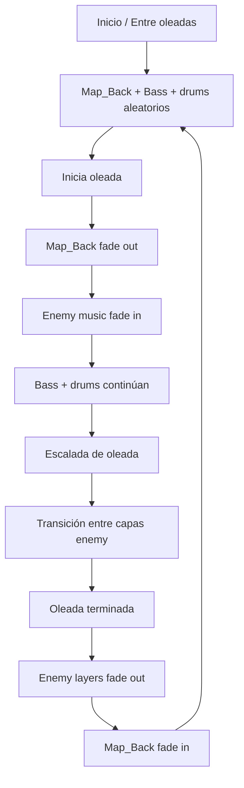

# Project M.A.S.K. – Midnight Masquerade

---

## 🎭 Concepto General

Project M.A.S.K. es un juego de acción en vista superior ambientado en un museo durante la medianoche. El jugador debe defender un objeto central mientras hordas de enemigos atacan desde diferentes puntos del mapa.

La mecánica principal gira alrededor de máscaras mágicas: cada máscara cambia la forma en que el jugador ataca y controla a los enemigos.

El tema Masks no es visual únicamente: la máscara define quién eres y cómo juegas.

---

## 🎮 Experiencia del Jugador

El jugador es un guardián solitario dentro de un museo cerrado, rodeado de arte, historia y caos nocturno.

La experiencia es:

- **Rápida**
- **Intensa**
- **Fácil de entender**
- **Difícil de dominar**

No hay diálogos largos ni sistemas complejos: entras, juegas y sobrevives.

---

## 🧠 Loop Principal del Juego (MVP)

1. Comienza una oleada de enemigos
2. El jugador se mueve libremente por el museo
3. El disparo es automático
4. Aparecen máscaras en puntos específicos del mapa
5. El jugador cambia de máscara para adaptarse a la situación
6. Sobrevive a la oleada
7. La siguiente oleada es más difícil

Este ciclo se repite hasta que el objetivo es destruido.

---

## 🎭 Las Máscaras (Mecánica Central)

Las máscaras son el corazón del juego.

- Solo se puede usar una máscara a la vez
- Se pueden cambiar durante la partida
- Cada máscara altera el ataque del jugador

### Máscaras del MVP

| Máscara | Efecto | Uso Estratégico |
|---------|--------|-----------------|
| **Máscara de Fuego** | Daño continuo (DoT) | Ideal contra grupos |
| **Máscara de Hielo** | Ralentiza | Control del espacio |
| **Máscara Trueno** | Paraliza | Detiene enemigos |
| **Máscara Regular** | Ataque básico | Sin efectos especiales |

> No hay mejoras, árboles de habilidades ni compras en el MVP.

---

## 🏛️ Escenario

- **Un solo mapa:** Museo
- **Espacio cerrado, reconocible y legible**
- Elementos visuales estáticos (cuadros, esculturas, vitrinas)
- El objetivo a defender se encuentra en el centro

El museo sirve como identidad visual y narrativa, no como sistema complejo.

---

## 👾 Enemigos

Los enemigos representan distintos arquetipos:

- **Enemigos lentos y resistentes**
- **Enemigos rápidos y frágiles**

Esto obliga al jugador a cambiar de máscara y moverse estratégicamente.

> No se busca variedad extrema, sino claridad de roles.

---

## 🎮 Controles y Accesibilidad

- Movimiento con **WASD** o **flechas**
- **Disparo automático**
- Controles simples, jugable con una mano

El juego debe entenderse en segundos, incluso para alguien que lo prueba por primera vez.

---

## 🔊 Audio y Arte

### Audio

Sistema de música adaptativo por capas que reacciona a las oleadas mientras mantiene un ritmo constante de movimiento del jugador.

#### Reglas del Sistema de Audio
- **Sin cortes bruscos:** todo el audio inicia con fade-in y termina con fade-out
- **Orientado a estados:** el audio cambia solo cuando cambia el estado de juego
- **Capas centradas en el jugador:** persisten durante el combate

#### Capas de Audio
| Capa | Comportamiento | Descripción |
|------|----------------|-------------|
| **Bass 1** | Siempre activa | Representa el caminar / latido del corazón |
| **Bass 2** | Esporádica | Fade in/out aleatorio durante interludios |
| **Drums 1-3** | Aleatorio | Puede sonar durante exploración y combate |
| **Map_Back** | Solo interlude | Reproduce cuando no hay enemigos; fade out al inicio de oleada |
| **Enemy Layers 1-4** | Solo oleadas | Una capa a la vez; transicionan en orden (1 → 4 → loop) |

#### Flujo de Gameplay

#### API Pública
- `enter_map()` → Reproduce audio de interlude (sin enemigos)
- `enemies_appear()` → Inicia música de enemigos, detiene Map_Back
- `enemy_next_layer()` → Avanza a la siguiente capa de enemigo
- `enemies_defeated()` → Detiene capas enemy, retorna a interlude

#### Efectos de Sonido Requeridos
- Cambio de máscara
- Ataques
- Daño al objetivo
- Inicio de oleada
- Victoria de oleada

### Arte

- Identidad visual clara basada en máscaras
- Museo estilizado (no realista)
- Enemigos y máscaras fácilmente distinguibles
- Detalles visuales como easter eggs (arte en cuadros)

---

## 🚫 Fuera de Alcance del MVP

Para asegurar que el juego se entregue a tiempo:

- ~~No multijugador~~
- ~~No sistemas de economía~~
- ~~No múltiples mapas~~
- ~~No puzzles~~
- ~~No torres ni construcción~~
- ~~No historia extensa~~

> Estas ideas existen, pero no forman parte de esta entrega.

---

## 🎯 Objetivo del MVP

Entregar un juego:

- ✅ Jugable de inicio a fin
- ✅ Que represente claramente el tema Masks
- ✅ Divertido en sesiones cortas
- ✅ Estable y comprensible para jueces y jugadores

> **Si el jugador entiende que cambiar de máscara es la clave para sobrevivir, el objetivo está cumplido.**

---

*Documento de diseño - MVP*
